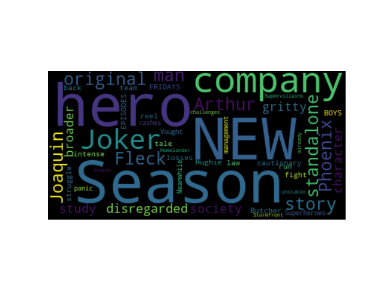

## Summary

- Creating a Selenium script to generate a **WordCloud** Visualization by analysing **Amazon Prime Video** website and iterating with specified number of movies count.
- Parsing over and creating a new dataset as **PrimeVideos.csv** file using Selenium, BeautifulSoup web scrapping in Python.

## Python Packages to install

1. Venv
2. Pandas
3. Selenium
4. BeautifulSoup4
5. Matplotlib
6. WordCloud

## Steps

1. Activate Virtual environment if need first to install the packages or install globally
2. Modify **file permission** for main.py using **chmod +x main.py**
3. While executing the script, run as **./main.py no_of_records ratings_above**, where 
   i. **no_of_records** - list of movies to scan. 
   ii. **ratings_above** - Ratings equal or above which, the WordCloud should generate.
4. The url used for web scrapping is https://www.amazon.com/gp/video/storefront/

## Output: WordCloud

